<div align="center">

# 🚀 Kayra Sari

### Personal Website & Engineering Portfolio

[](https://thekayrasari.github.io)
[](https://gohugo.io/)
[](https://pages.github.com/)
[](LICENSE)

**[🌐 Visit Website](https://thekayrasari.github.io)** • **[📝 Articles](https://thekayrasari.github.io/articles)** • **[🛠️ Projects](https://thekayrasari.github.io/projects)**

---

</div>

## 👨‍🚀 About Me

I'm a high school student with a passion for **Aerospace Engineering**, focused on mastering fundamentals through hands-on projects in:

```
🔧 CAD Design     🚀 Rocketry     🤖 Robotics     ✈️ Aerodynamics
```

This website serves as my digital workshop—showcasing technical articles, engineering projects, and my journey toward the stars.

---

## ✨ Features

<table>
  <tr>
    <td align="center">🎨</td>
    <td><b>Clean Design</b><br/>Minimalist portfolio with PaperMod theme</td>
  </tr>
  <tr>
    <td align="center">📱</td>
    <td><b>Mobile Responsive</b><br/>Perfect on all devices</td>
  </tr>
  <tr>
    <td align="center">⚡</td>
    <td><b>Lightning Fast</b><br/>Static site generation with Hugo</td>
  </tr>
  <tr>
    <td align="center">🌓</td>
    <td><b>Dark/Light Mode</b><br/>Automatic theme switching</td>
  </tr>
  <tr>
    <td align="center">🔄</td>
    <td><b>Auto Deploy</b><br/>Push to main → live in seconds</td>
  </tr>
</table>

---

## 🛠️ Tech Stack

<div align="center">


</div>

| Component | Technology |
|-----------|-----------|
| **Static Site Generator** | Hugo Extended v0.139.3+ |
| **Theme** | PaperMod |
| **Hosting** | GitHub Pages |
| **CI/CD** | GitHub Actions |
| **Content** | Markdown |

---

## 💻 Local Development

### Prerequisites

Before you begin, ensure you have:

- ✅ **Hugo Extended** (v0.139.3 or later) - [Download here](https://github.com/gohugoio/hugo/releases)
- ✅ **Git** - For version control

### 🚀 Quick Start

**1️⃣ Clone the repository:**
```bash
git clone https://github.com/thekayrasari/thekayrasari.github.io.git
cd thekayrasari.github.io
```

**2️⃣ Start the dev server:**
```bash
hugo server -D
```

**3️⃣ Open your browser:**
```
🌐 http://localhost:1313
```

---

## 📝 Adding Content

### Create New Article
```bash
hugo new articles/your-article-name.md
```

### Create New Project
```bash
hugo new projects/your-project-name.md
```

**Then:**
1. ✏️ Edit the markdown file in `content/`
2. 💾 Save your changes
3. 📤 Commit and push to `main`
4. ✨ Site auto-deploys in ~1 minute!

---

## 🚀 Deployment

```mermaid
graph LR
    A[💻 Edit Code] --> B[📤 Push to main]
    B --> C[⚙️ GitHub Actions]
    C --> D[🏗️ Build Site]
    D --> E[🌐 Deploy to Pages]
    E --> F[✅ Live in ~60s]
```

<div align="center">



</div>

**Fully automated!** Just push to `main` branch and GitHub Actions handles the rest.

No manual deployment needed. Ever. 🎉

---

## 📁 Project Structure

```
thekayrasari.github.io/
│
├── 📂 .github/
│   └── workflows/
│       └── hugo.yaml              # 🤖 Auto-deployment config
│
├── 📂 content/
│   ├── articles/                  # 📝 Blog posts & technical articles
│   │   ├── _index.md
│   │   └── your-article.md
│   └── projects/                  # 🛠️ Project showcases
│       ├── _index.md
│       └── your-project.md
│
├── 📂 static/                     # 🖼️ Images, PDFs, static files
│   └── profile.jpg
│
├── 📂 themes/
│   └── PaperMod/                  # 🎨 Theme files
│
├── 📄 hugo.yaml                   # ⚙️ Site configuration
├── 📄 .gitignore
└── 📄 README.md                   # 👋 You are here!
```

---

## 🤝 Connect With Me

<div align="center">

[](https://github.com/thekayrasari)
[](https://x.com/thekayrasari)
[](https://linkedin.com/in/thekayrasari/)
[](mailto:thekayrasari@gmail.com)

</div>

---

## 📊 Repository Stats

<div align="center">


</div>

---

## 📜 License

This project is open source and available under the **MIT License**.

Feel free to fork, modify, and use for your own portfolio!

---

<div align="center">

### 🌟 If you find this useful, give it a star!

**Built with ❤️ by [Kayra Sari](https://thekayrasari.github.io)**

*Powered by Hugo & GitHub Pages*

[](https://gohugo.io/)
[](https://pages.github.com/)

</div>
