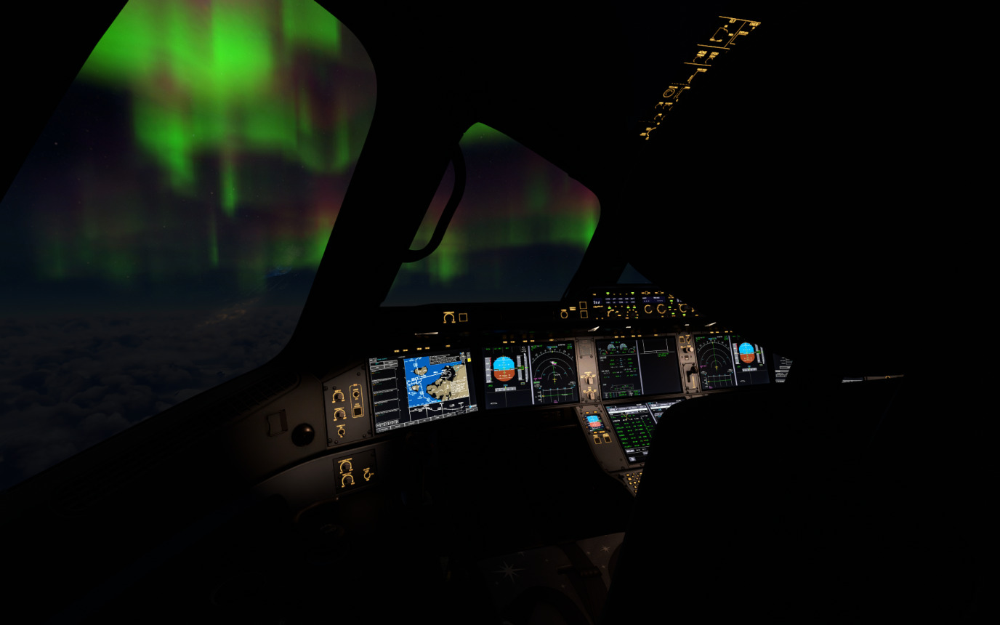
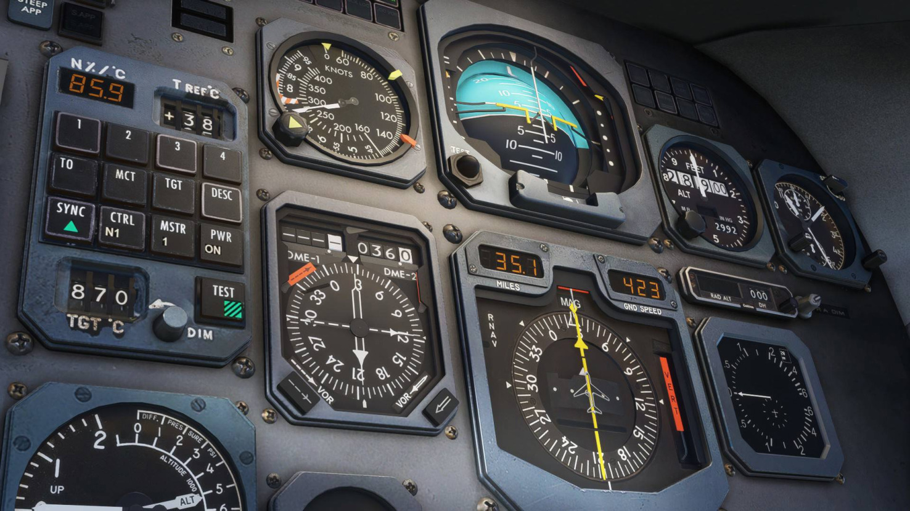
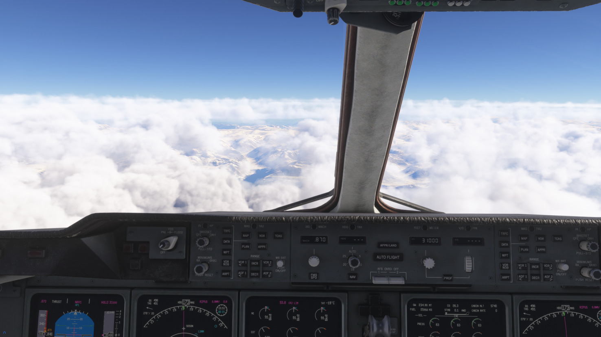
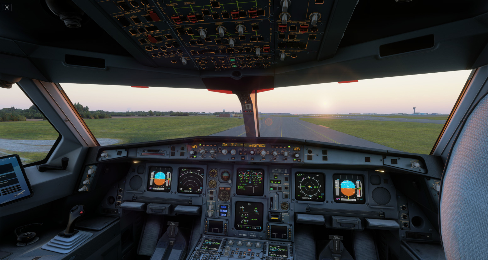
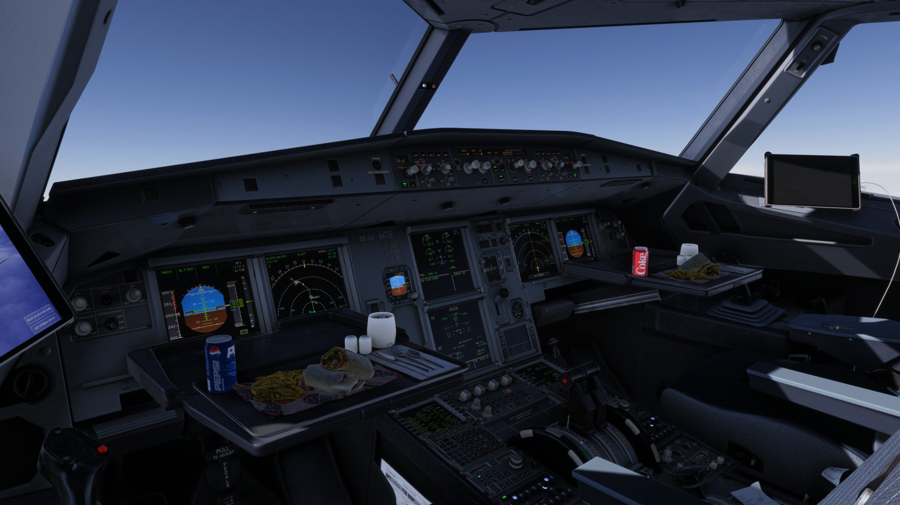
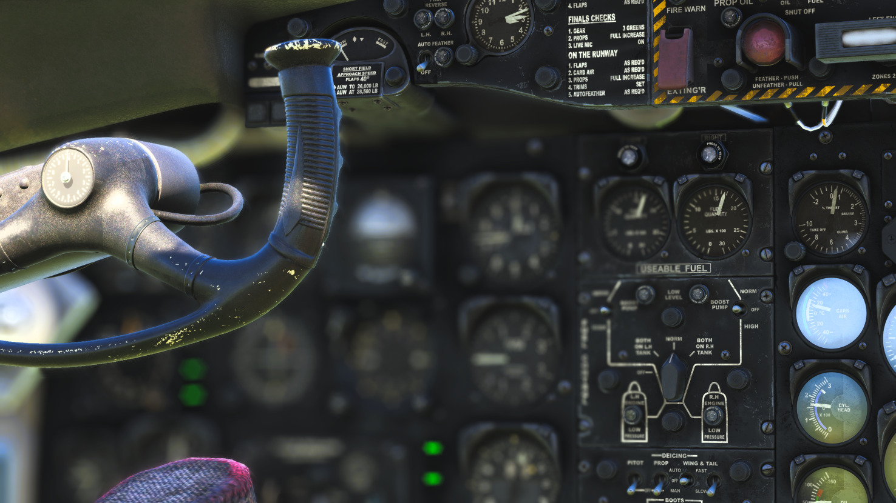
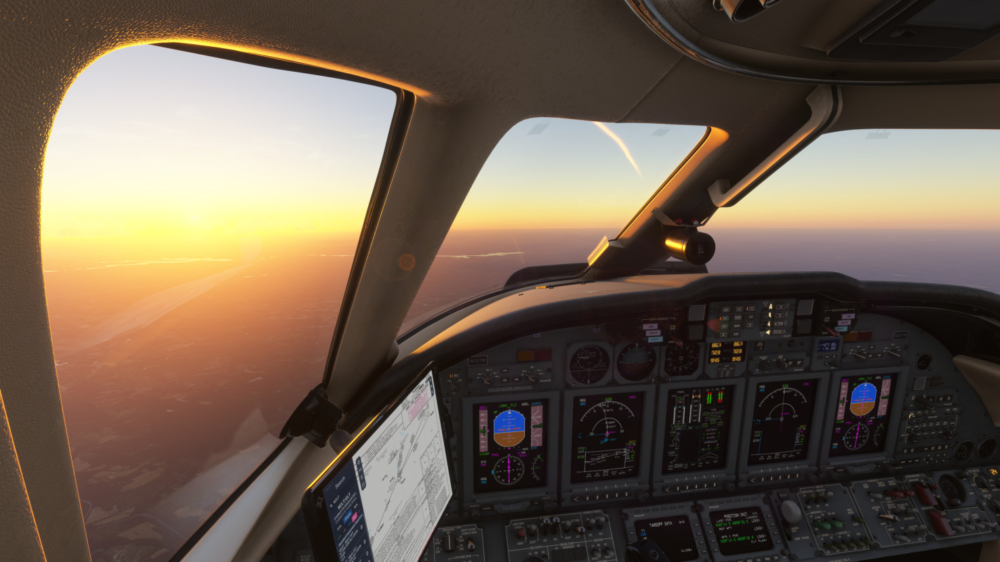
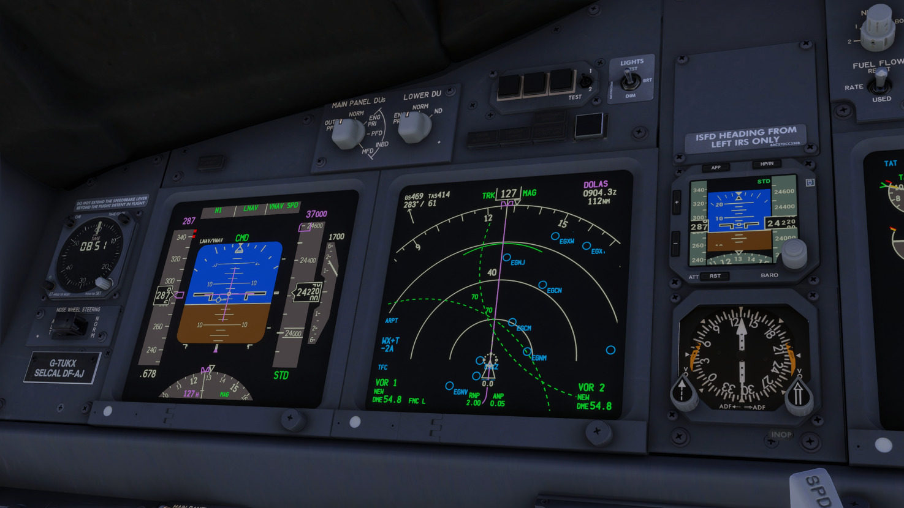

Welcome to my flight simulation gallery. When I am not immersed in coding or aerospace engineering coursework, you can often find me exploring the virtual skies. Flight simulation allows me to study complex aviation systems, aircraft performance, and operations in a dynamic, real-time environment.

Here are a few moments captured during my virtual flights.

